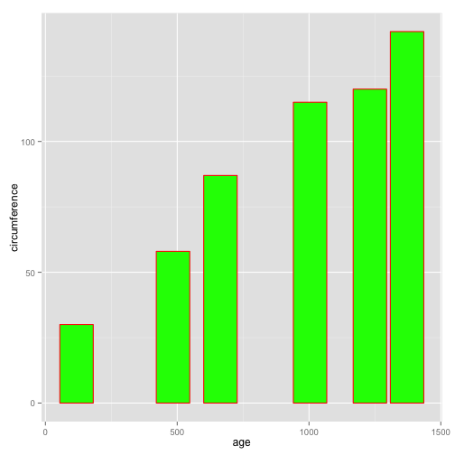

## About the Project

- This presentation is about the Growth of Orange Tree
- Takes a selected input for a tree and displays the circumference based on the age 
- By changing the age range using a slider changes the circumference for any selected tree.

---

## Orange Data Source 

The Orange data set contains data about the Orange trees, their age and circumference.


```r
library(datasets)
data(Orange)
summary(Orange)
```

```
##  Tree       age         circumference  
##  3:7   Min.   : 118.0   Min.   : 30.0  
##  1:7   1st Qu.: 484.0   1st Qu.: 65.5  
##  5:7   Median :1004.0   Median :115.0  
##  2:7   Mean   : 922.1   Mean   :115.9  
##  4:7   3rd Qu.:1372.0   3rd Qu.:161.5  
##        Max.   :1582.0   Max.   :214.0
```

```r
dim(Orange)
```

```
## [1] 35  3
```

---
## Code Snippet

In the below code snippet we have created some shiny widgets like an input text dropbox to select the choice of Orange tree by the tree number given, a selected tree displays the age and circumference related to that Tree.   
Also craeted a slider with ageRange as an input and takes in the paraments age as well as circumference and outputs a barplot 
displaying the change in circumference with age for a selected tree. 


inputPanel(
  selectInput("Tree", label = "Tree Number",
      choices = c(1, 2, 3, 4, 5), selected = 1),
  
  sliderInput("ageRange", label = "Age of Orange Tree:",
              min = 100, max = 1600, value = c(100, 1600),  step = 0.2)
)

---
## Sample Plot
Using the input from the slider and tree selection widget, we plot a bar plot.See below and example/plot.

 

---
Refernces
To see a full working demo of the project go to https://pratheebha-lakshminarayanan78.shinyapps.io/demo


Complete code and additional documentation can be found at  https://github.com/pratheebha/Developing-Data-Products
